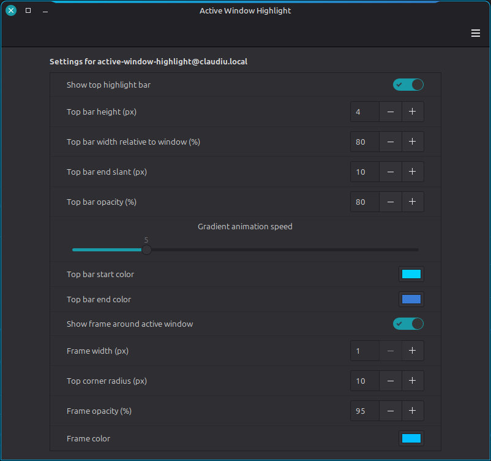
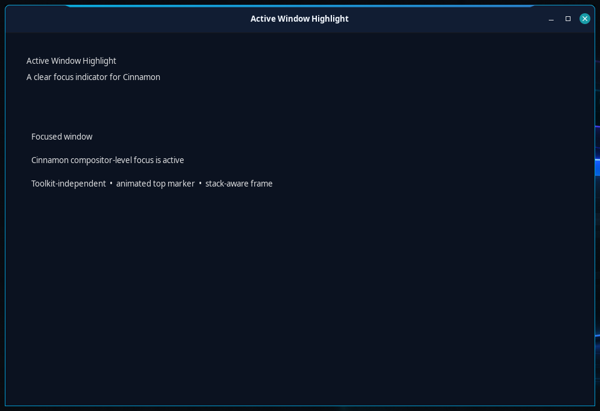

<p align="center">
  
</p>

<h1 align="center">Active Window Highlight</h1>

<p align="center">
  A clear, toolkit-independent focus indicator for Cinnamon — with an animated
  top bar, configurable frame and compositor-correct stacking.
</p>

<p align="center">
  <a href="https://github.com/ClaudiuSchuster/cinnamon-active-window-highlight/actions/workflows/check.yml"></a>
  <a href="LICENSE"></a>
  
  
</p>

The extension draws at compositor level, so the highlight also works around
Chromium, Qt, Wine and other non-GTK windows.



The screenshot shows Cinnamon's native settings window. Every option can be
changed while the extension is running.

## What it provides

- A configurable four-sided frame with independently controlled color,
  thickness, opacity and top-corner radius.
- An optional animated gradient bar above the focused window.
- Live settings through Cinnamon's native extension dialog.
- Support for normal windows, dialogs, modal dialogs and utility windows.
- Correct Muffin stacking: always-on-top windows and Cinnamon Shell surfaces
  remain above the highlight.

### Highlight detail



The default frame is blue, 1 px wide and 95% opaque. Its top corners use a
configurable 10 px radius while its bottom corners stay square to match
Cinnamon's default window shape. Normal windows, dialogs, modal dialogs and
utility windows are supported; fullscreen and minimized windows are
intentionally ignored. All appearance options are exposed through Cinnamon's
native extension settings.

Both the bar and frame are stacked immediately above the focused window. Other
windows that Muffin keeps higher — including **Always on Top** windows — remain
above the highlight. Cinnamon's start menu, panels, Expo, overview and other
Shell surfaces remain above it as well.

> **Screenshot note:** A “current window” capture may omit the animated top bar
> because it is a Cinnamon compositor overlay, not part of the application's
> own window surface. Use an area or full-screen capture when the complete
> highlight should be visible. This only affects screenshots, not the normal
> on-screen display.

## Installation

```bash
git clone https://github.com/ClaudiuSchuster/cinnamon-active-window-highlight.git
cd cinnamon-active-window-highlight
./install.sh
```

Then disable and re-enable **Active Window Highlight** in **System Settings →
Extensions**. The installer does not alter enabled extensions or restart
Cinnamon automatically. To install a later version, run `git pull` in the
checkout followed by `./install.sh` again.

Run `./uninstall.sh` to remove the extension files. Disable the extension
before uninstalling it. User settings are deliberately retained.

## Requirements

Cinnamon 5.8 or newer is supported. The extension has no separate runtime
daemon and no toolkit-specific dependency.

## Development

```bash
make check
```

The checks validate JavaScript syntax, compositor-stacking invariants, JSON
schemas and shell scripts. Every push and pull request runs the same validation
in GitHub Actions.

## Origin and license

The animated trapezoid top-bar design and its gradient animation are derived
from **Active Window Indicator** by `fabiodamio`, as distributed in Linux
Mint's `cinnamon-spices-extensions` repository. This project adds the
toolkit-independent four-sided frame, dialog support, a unified settings
schema and corrected Cinnamon UI layering. See `ATTRIBUTION.md`.

Licensed under GPL-2.0-or-later. See `LICENSE`.
