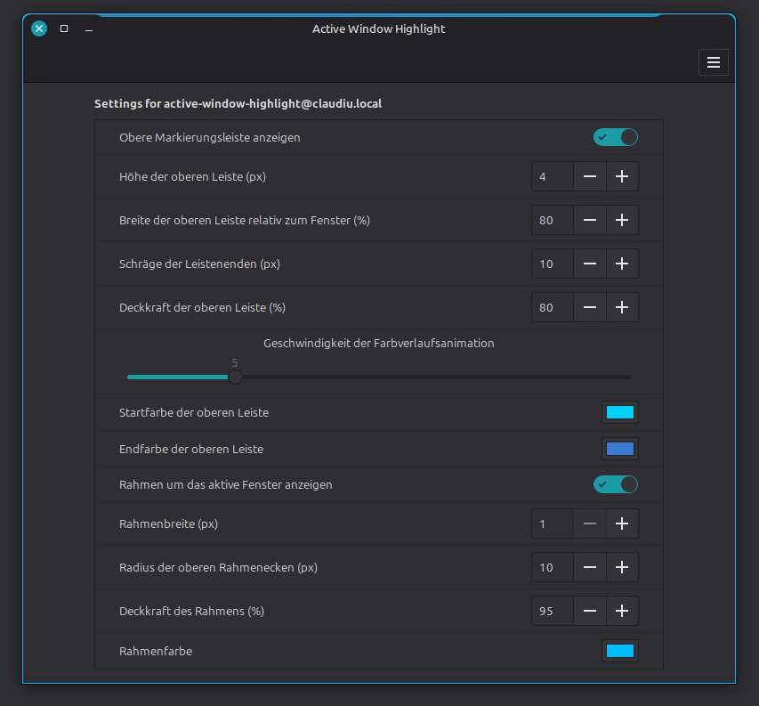

# Active Window Highlight

A Cinnamon extension that highlights the focused window with an animated top
bar and a configurable frame. Because it draws at compositor level, the frame
also works around Chromium, Qt, Wine and other non-GTK windows.



The screenshot shows Cinnamon's native settings window on a German system.
Every option can be changed while the extension is running.

### Highlight detail


The default frame is blue, 1 px wide and 95% opaque. Its top corners use a
configurable 10 px radius while its bottom corners stay square to match
Cinnamon's default window shape. Normal windows, dialogs, modal dialogs and
utility windows are supported; fullscreen and minimized windows are
intentionally ignored. All appearance options are exposed through Cinnamon's
native extension settings.

Both the bar and frame live above application windows but below Cinnamon's own
UI layer. The start menu, panels, Expo, overview and other Shell surfaces
therefore remain on top of the highlight.

> **Screenshot note:** A “current window” capture may omit the animated top bar
> because it is a Cinnamon compositor overlay, not part of the application's
> own window surface. Use an area or full-screen capture when the complete
> highlight should be visible. This only affects screenshots, not the normal
> on-screen display.

## Installation

```bash
git clone https://github.com/ClaudiuSchuster/cinnamon-active-window-highlight.git
cd cinnamon-active-window-highlight
./install.sh
```

Then disable and re-enable **Active Window Highlight** in **System Settings →
Extensions**. The installer does not alter enabled extensions or restart
Cinnamon automatically. To install a later version, run `git pull` in the
checkout followed by `./install.sh` again.

Run `./uninstall.sh` to remove the extension files. Disable the extension
before uninstalling it. User settings are deliberately retained.

## Origin and license

The animated trapezoid top-bar design and its gradient animation are derived
from **Active Window Indicator** by `fabiodamio`, as distributed in Linux
Mint's `cinnamon-spices-extensions` repository. This project adds the
toolkit-independent four-sided frame, dialog support, a unified settings
schema and corrected Cinnamon UI layering. See `ATTRIBUTION.md`.

Licensed under GPL-2.0-or-later. See `LICENSE`.
